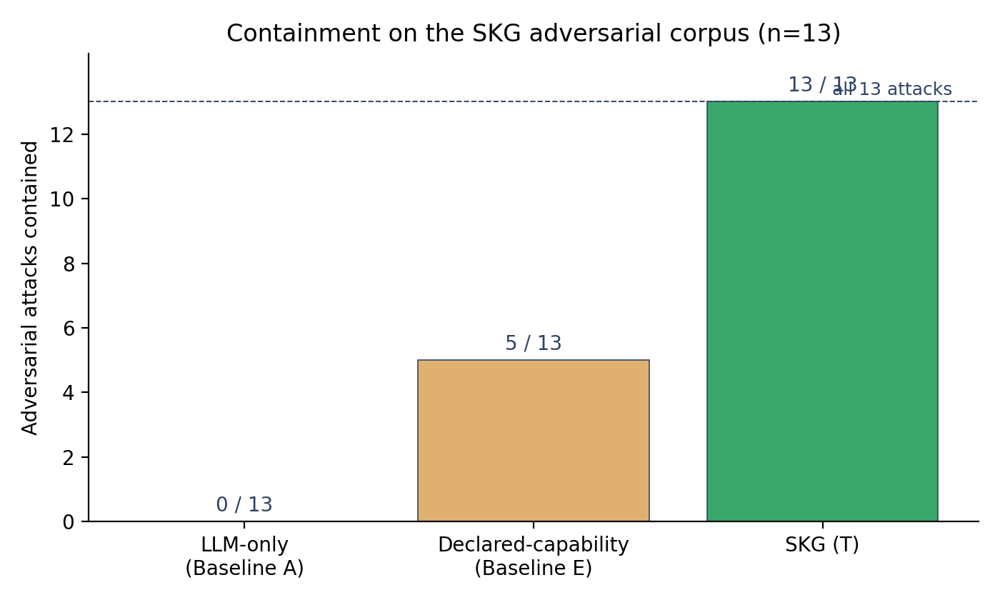

# 🛡️ Skill Knowledge Graph

> Capability-token enforcement for LLM-synthesized code.
> The runtime is the gate, not the manifest.


When an LLM agent runs code, the manifest tells you what the code
is *supposed* to do. SKG makes the WASM runtime physically prevent
anything else, on every call, with per-run capability tokens.



> Adversarial-corpus differential: **SKG contains 13 / 13 attacks**
> across manifest-lies, path-escape, and WASI-introspection classes.
> A declared-capability baseline (manifest checked once at load,
> trusted at runtime) contains 5 / 13. Reproduce with
> `pytest tests/test_containment_matrix.py -q`.

---

## ⚡ 60-second install

```bash
git clone https://github.com/bdube83/skill-knowledge-graph.git
cd skill-knowledge-graph
python3.13 -m venv .venv
.venv/bin/pip install -e .
```

That is it. No daemon, no Docker, no API key required to start.

## 🚀 30-second example

Route a task through SKG and use the result in your existing agent:

```python
from skg.integrations.agent_proxy import route_proposal, build_prompt_prefix

result = route_proposal("Draft a reviewer ping for PR review")

if result.hit:
    prompt = build_prompt_prefix(result) + "\n" + your_existing_prompt
    response = your_llm.chat(prompt)
else:
    response = your_llm.chat(your_existing_prompt)
```

`result.hit` is true when SKG knows a verified procedure for this
task. Otherwise your code falls through; SKG never blocks.

For direct-execution-with-grants:

```python
from skg.wasmtime_launcher import WasmtimeRuntime
rt = WasmtimeRuntime()
out = rt.execute(
    wasm_path        = "nodes/reviewer-ping-draft/target/wasm32-wasip1/release/reviewer_ping_draft.wasm",
    node_id          = "reviewer-ping-draft",
    task             = "draft a ping",
    context          = {"pr_number": 42, "reviewers": ["bob"]},
    granted_effects  = ["text.generate"],
)
print(out.success, out.output)
```

A node that imports a host function it was not granted **fails at
instantiate-time, not at call-time**. The linker simply does not
have the import.

---

## 🤔 Why use SKG

You are running an LLM agent that calls real code. Three things
go wrong without enforcement:

| Problem | What happens | What SKG does |
|---|---|---|
| 🪤 **Manifest lies** | LLM-synthesized node declares `text.generate` only, but the source actually opens a network socket. | Linker has no `network` import; instantiation fails. |
| 🐍 **Confused deputy** | A benign node accepts attacker-controlled input that contains a URL outside its grant. | Per-call wrapper validates the URL pattern; out-of-scope returns `ERRNO_DENIED` (13). |
| 🔓 **Path escape** | Node has `local.read` for `/workspace`, tries `path_open("/etc/passwd")`. | Path scope is enforced at every WASI call; out-of-scope returns `ERRNO_NOENT` (44). |

Every external operation a node performs lands in an append-only
audit log under `~/.skg/`. Drafts, sent messages, browser actions,
production writes, and git ops each get their own audit directory.

---

## 🧱 What is in the box

- 🛂 **GrantedLinker:** per-run Wasmtime linker that wires only the imports the grant set permits. No `define_wasi()` blanket; no manifest-trusted host surface.
- 📜 **12 + 1 effect classes:** `local.read/write`, `network.read/write`, `external.draft/send`, `browser.read/write`, `git.read/write`, `secret.read`, `production.write`, `text.generate`. Three of them are approval-gated.
- 🧭 **4-stage router:** exact, FTS, vector, graph composition. Picks a verified procedure before falling back to the LLM.
- ✅ **6-gate promotion:** hash, unit tests, replay tests, dry-run attestation, observed-effects-subset-of-granted-caps, human approval. New nodes are CANDIDATE until they pass all six.
- 🧰 **10 real host adapters:** HTTP via urllib, git via subprocess (read whitelist + write whitelist), secrets via `~/.skg/secrets/`, drafts/sends/browser-queues/production-log via append-only audit dirs.
- 📚 **5 baseline runtimes:** SKG itself, declared-capability, flow-registry, semantic-cache, flat-tool-library, plus a real LLM-only runner. Drop any one into the same `execute(...)` interface.

---

## 🆚 Compared to your alternatives

| | LLM-only | Declared-cap | Flat tool lib | **SKG** |
|---|:---:|:---:|:---:|:---:|
| Per-call gate at host imports | ❌ | ❌ | ❌ | ✅ |
| Unforgeable run-scoped handles | ❌ | ❌ | ❌ | ✅ |
| Dry-run before promotion | ❌ | ❌ | ❌ | ✅ |
| Append-only attestation chain | ❌ | ❌ | ❌ | ✅ |
| Routes around the LLM on hits | ❌ | ❌ | partial | ✅ |
| Recovers from compromised LLM synthesis | ❌ | ❌ | ❌ | ✅ |

The adversarial-corpus differential at the top of this README is
exactly this comparison, measured.

---

## 🏗️ Architecture


User request flows through the task normalizer, then the 4-stage
router, then the policy engine that mints unforgeable handles, then
Wasmtime under those handles only, then the verifier set, then the
commit planner. Vector source: `figures/fig1_architecture.svg` (and
`.dot`, `.pdf`).

---

## 🔬 What is honestly NOT supported yet

- ⏳ **50% token reduction.** SKG saves ~36% input tokens on a
  larger-context corpus (200 tasks, median ~1265 tokens each); on
  short-task corpora it costs ~26% more because the 120-token
  routing header dominates. Verified by paired one-sided t-test
  (`p = 0.9999`, `Cohen's d = -0.75`) in `paper.md` Section 7.4.
- ⏳ **Vector-stage routing.** Currently 0 / 200 hits. The pipeline
  is correct (an exact-header match returns 1.0); the bottleneck is
  the placeholder `local-hash-v1` embedding, not Qdrant. Replacing
  it with a learned embedding is on the roadmap.
- ⏳ **Graph composition empirics.** Quantitative T-vs-flat-library
  tests need composable node pairs; deferred to a follow-up paper.

We tell you what works *and* what doesn't, with measurements. See
[`paper.md`](paper.md) for the full evaluation methodology.

---

## 📦 Where to go next

- [`docs/integration.md`](docs/integration.md): longer integration guide. Effect classes, manifest schema, adding a node, manifest-declared scopes (Phase 3d), the adversarial test surface.
- [`paper.md`](paper.md) / [`paper.pdf`](paper.pdf): the research paper.
- [`docs/paper-reproduction.md`](docs/paper-reproduction.md): how to recreate the paper's measurements end-to-end.
- [`eval/RATING_WORKFLOW.md`](eval/RATING_WORKFLOW.md): multi-rater workflow for routing precision (Cohen kappa, Krippendorff alpha).

---

## 🤝 Contributing

The repo is a research preview. Issues and PRs are welcome,
especially for:
- Real-world adapters (Slack, GitHub Comments, Linear) on top of `skg.host_adapters`.
- A learned embedding to replace `local-hash-v1` in `skg/index.py`.
- Composable nodes to test graph-composition empirically.
- Multi-rater labels to populate the routing-precision form (`eval/rating_runner.py`).

Run `pytest tests/ -q` before opening a PR; 221 tests as of `1385cbc`.

---

## 📚 Citation

```bibtex
@misc{dube2026skg,
  title  = {Skill Knowledge Graph: Capability-Token Enforcement for LLM-Synthesized Procedures},
  author = {Dube, Bongani},
  year   = {2026},
  note   = {Paystack. Draft},
  url    = {https://github.com/bdube83/skill-knowledge-graph}
}
```

## 📄 License

Apache 2.0. See [`LICENSE`](LICENSE).
