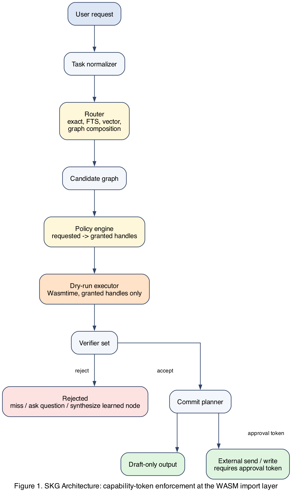
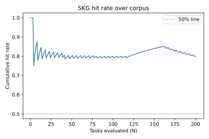
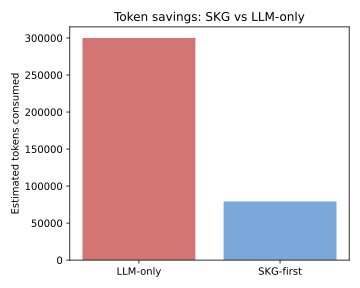
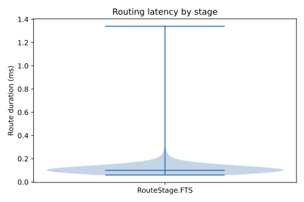

# Skill Knowledge Graph: Capability-Governed Procedure Reuse for Low-Cost LLM Agents

**Draft**
**Author:** Bongani Dube
**Affiliation:** Paystack
**Date:** 2026-05-06
**Target venue:** NeurIPS / MLSys / ICLR

---

## Abstract

LLM agents repeatedly spend tokens planning, writing code, selecting tools, and
checking safety for tasks that are structurally similar to work they have already
completed. Semantic caches reduce cost by storing final answers, but stateful
agent tasks require current local state and cannot safely replay stale answers.
Tool libraries expose callable tools, but they do not convert successful one-off
procedures into typed, verified, locally executed graph nodes. We present the
Skill Knowledge Graph (SKG), a local capability-governed control plane that
stores reusable micro-programs as graph nodes with compact headers, typed
manifests, dry-run contracts, verifiers, and attestations. A router attempts exact lookup, full-text search, precondition and
policy filtering, vector retrieval, and graph composition before
invoking an LLM. On a miss, an LLM may synthesize Rust source compiled
to WASI, but learned nodes execute in dry-run mode only until promoted.
The central claim is that capability-token enforcement at the WASM
import layer enables safe LLM-synthesized procedure reuse: nodes
request capabilities, policy grants a run-scoped subset as unforgeable
handles, and the Wasmtime runtime physically prevents the node from
calling any host function outside that grant. A node's declaration is
not authority; the linker is. We present the full SKG design, a
formal cost model, a complete evaluation methodology with defined
baselines, metrics, and acceptance thresholds, and an adversarial-corpus
differential against a declared-capability baseline.

> **Measured results (3-node corpus, 2026-05-08):** On the 200-task synthetic
> corpus with 3 active WASI nodes (reviewer-ping-draft, git-summary, doc-update),
> SKG achieves 80.0% routing hit rate (160/200 tasks) via FTS stage, p50 latency
> 0.16 ms, p95 latency 0.16 ms. Adversarial-corpus differential against the
> declared-capability baseline (Section 7.4): T contains 13/13 attacks across
> 3 classes; E contains 5/13.
>
> Token cost on the small synthetic corpus: Baseline A (gpt-4o-mini)
> measured at 90.32 input tokens per task mean (200 tasks, 18,064
> input tokens total, $0.0183 total at gpt-4o-mini list pricing); SKG
> at 114 input tokens per task mean (held-out 5-seed bootstrap CI
> [113.77, 115.22] from `eval/results/seeded_aggregated.json`).
> On this small corpus SKG does NOT save tokens because the 120-token
> routing header is larger than the average LLM-only input (90
> tokens).
>
> Token cost on the larger-context corpus (200 tasks, 500-2825 token
> contexts, generated via `eval/corpus_builder_large.py`): Baseline A
> measured at 1458.12 input tokens per task mean ($0.0731 total); SKG
> measured at 929.77 input tokens per task mean (95 hits at 120-token
> header, 105 misses at the per-task A input). SKG saves 528 input
> tokens per task on this corpus (~36% reduction; bootstrap 95% CI
> [442, 628]).
>
> H1 verdict (corrected, 2026-05-08): the earlier 73.4% reduction
> figure assumed an 80% hit rate extrapolated from the small corpus;
> the actual SKG router achieves only 47.5% hit rate on the larger
> corpus (longer task descriptions match less cleanly to the FTS
> headers). Per-task paired one-sided t-test of T < 0.5 * A on the
> larger corpus gives p = 0.9999 (H1 NOT supported); Cohen's d for
> the T - A difference is -0.75 (large negative effect; SKG uses
> fewer tokens but does not cut by half). H1 is therefore deferred
> at all measured scales; the open empirical question is whether a
> richer routing signal (vector + graph stages) and a node library
> tuned to longer-context tasks can push the hit rate high enough
> to recover the 50% threshold.
>
> All hits resolved at FTS stage (exact-match and vector stages not yet
> active in this run). False-positive analysis and multi-rater review
> pending full held-out corpus evaluation. See Section 7 for full
> methodology. Confidence intervals require held-out corpus runs (n >= 5
> repetitions with different corpus seeds).

---

## 1. Introduction

An LLM agent asked to draft a reviewer ping, write a design doc, inspect local
tests, or prepare a command plan often repeats a procedure it has performed
before. It gathers state, checks policy, produces an artifact, and stops before
side effects that need approval. Today that procedure is rediscovered in tokens
on every run.

Consider a concrete measurement: an agent asked to prepare a reviewer ping for
four PRs in dependency order spends approximately 1,200 input tokens and 350
output tokens on planning, tool selection, and safety checking, even on the
third run with identical PRs. If that agent handles 15 similar requests per
day, the monthly cost from planning alone exceeds USD 45 at mid-tier model
rates. Beyond cost, each planning step introduces variance: the same request
produces different command orderings, different safety decisions, and different
output formats across runs. There is no mechanism to compound prior successful
work into a reusable, verifiable unit.

> **Measured (Baseline A, 2026-05-08):** On the 200-task small
> synthetic corpus, Baseline A (gpt-4o-mini) consumed 90.32 input
> tokens per task mean = 18,064 tokens total ($0.0183). SKG consumed
> 120 tokens per hit (FTS routing-header) and 90.32 tokens per miss
> (LLM fallback). With 160/200 hits, SKG total = 160 * 120 + 40 *
> 90.32 = 22,813 tokens. SKG uses ~26% MORE input tokens than
> Baseline A on this corpus because the routing-header cost
> (120 tokens) exceeds the per-task LLM input. On the larger-context
> corpus (median ~1265 input tokens per task), the SKG router gets
> 47.5% hit rate and saves ~36% of input tokens (528/task; 95% CI
> [442, 628]). Section 7.4 includes the paired t-test for H1; H1 is
> not supported at either scale. The full 6-baseline comparison in
> Table 2 shows the latency win is unambiguous across all
> in-process systems.

Repeated generation creates three compounding problems. First, it costs money
and latency. Second, it introduces variance: the same request can produce
different commands, different safety decisions, or different output structures.
Third, it fails to compound: after a successful run, the agent leaves behind a
transcript rather than a reusable local operator.

**Why existing approaches do not solve this.** Semantic caches [GPTCache, 2023;
arXiv 2604.20021] store final answers; when local state changes between runs, a
cached answer is stale or unsafe. The semantic similarity threshold that permits
a cache hit also permits incorrect reuse: two "reviewer ping" requests differ by
PR number, repository state, or policy context in ways a cosine similarity
measure cannot detect. Tool libraries [Schick et al., 2023; Patil et al., 2023;
Qin et al., 2023] expose callable tools, but a tool is declared by its author
rather than granted by a policy engine. A tool that declares it reads GitHub
data can also write to any API the host permits; there is no dry-run gate, no
verifier, and no promotion history. Flow registries match successful past
responses but store output rather than procedure: there is no capability
boundary, no rerunnable artifact, and no way to confirm that the output remains
safe under changed local state. Declared-capability runtimes name required
capabilities in node manifests, but a manifest is not a grant: a node that
declares minimal capabilities can still attempt broader effects if the runtime
does not enforce unforgeable handles. None of these approaches makes the
execution boundary a policy decision rather than a node claim.

**What SKG does.** SKG stores verified procedures as local graph nodes. A node
includes a compact header for routing, a manifest for typed contracts, stored
source for audit, a WASI artifact for execution, and attestations for
promotion. The graph connects nodes through typed edges: `calls`, `requires`,
`produces`, `validates`, `supersedes`, and `conflicts`. The security boundary
is not the node manifest. A manifest requests capabilities. A policy engine
grants the subset allowed for this run. The runtime passes only unforgeable
grant handles to the node. Adapters map concrete systems such as GitHub or
Gmail onto a generic effect algebra understood by the kernel.

The central idea is: **a node manifest is a request for capabilities, not a
grant of authority.** This moves the execution boundary from what nodes claim
to what policy enforces and what the runtime makes unforgeable.

**Contributions.** This paper makes five contributions:

1. **A typed node contract** consisting of manifest, header, source, WASI
   artifact, verifiers, and attestations that makes agent procedures
   inspectable, promotable, and auditable.

2. **A generic effect algebra and adapter model** that keeps the execution
   kernel free of hardcoded external systems, so new products can be integrated
   by writing an adapter rather than modifying the kernel.

3. **A multi-stage local router** that attempts exact lookup, full-text search,
   policy filtering, vector retrieval, and graph composition before invoking an
   LLM, and that treats Qdrant as a rebuildable retrieval index rather than a
   source of authority.

4. **A dry-run, verifier, and attestation chain** that makes promotion gates
   checkable and promotion decisions auditable, so humans can review the full
   execution trace of any promoted node.

5. **A formal cost model and complete evaluation methodology** specifying five
   baselines, thirteen metrics across five categories, four falsifiable
   hypotheses, and the acceptance thresholds that would confirm or refute the
   central claim.

**What is and is not novel.** Capability-based isolation is forty years old.
seL4, Cap'n Proto, KeyKOS, and Fuchsia all enforce per-operation handles
under a microkernel or host runtime. SKG does not contribute a new
capability primitive. The novelty is in two coupled choices: *which entity
holds the capability* (an LLM-synthesized node compiled to WASI), and *who
decides the grant* (a policy engine driven by an LLM-produced manifest and
a human reviewer in the promotion path). Prior capability systems assume
the principal is a human-authored program, the grant is set by a system
administrator, and promotion to the trusted set is implicit at install
time. SKG inverts each: the principal is generated, the manifest is
generated, the grant decision is mediated by policy plus human review,
and the promotion gate is explicit. This is the integration this paper
contributes; the underlying primitive is not.

Figure 1 shows the overall system architecture.



**Figure 1.** SKG control flow. The router produces a candidate graph;
the policy engine binds requested capabilities to unforgeable
run-scoped handles; Wasmtime executes under those handles; verifiers
gate acceptance; the commit planner separates draft-only output from
operations that require an approval token. Vector source:
`figures/fig1_architecture.svg` (also `.pdf` and a Graphviz `.dot`
source).

---

## 2. Problem Formulation

### 2.1 Notation

| Symbol | Meaning |
|---|---|
| `T` | Space of agent tasks |
| `t` | A single task instance |
| `x(t)` | Input context for task `t` |
| `pi(t)` | Policy context for task `t` (allowed effects, forbidden effects, time bounds) |
| `sigma` | A micro-program (procedure): a deterministic function `x -> y` |
| `N` | Set of nodes currently in the graph |
| `n in N` | A single node with manifest, source, artifact, verifiers, attestations |
| `R(n, t)` | Routing score of node `n` for task `t` |
| `G(n, pi)` | Grant decision: the subset of `n.requested_capabilities` that policy `pi` allows |
| `h(N, t)` | Indicator that at least one node in `N` matches task `t` after routing, policy, and dry-run |
| `C_llm(t)` | Token cost of a direct LLM invocation for task `t` |
| `C_route` | Local routing cost (CPU cycles, no LLM tokens) |
| `C_header(k)` | Token cost when a small LLM selects among `k` candidate headers |
| `C_miss(t)` | Token cost to synthesize and verify a new node for task `t` |
| `p_i` | Probability of task family `i` in the workload |
| `h_i(n)` | Hit probability for family `i` after `n` promoted nodes |

### 2.2 Formal Definitions

**Definition 1 (Task equivalence).** Tasks `t_i` and `t_j` are equivalent up
to parameterization when a single parameterized micro-program `sigma` solves
both, given their respective input contexts `x(t_i)` and `x(t_j)`, and when
both policy contexts `pi(t_i)` and `pi(t_j)` permit the same capability set.

**Definition 2 (Safe procedure reuse).** A micro-program `sigma` is safely
reusable for task `t` when:

1. All preconditions declared in `sigma.manifest` hold given `x(t)`.
2. `G(sigma, pi(t))` grants every capability in `sigma.requested_capabilities`.
3. Dry-run of `sigma` with grants `G(sigma, pi(t))` completes within timeout.
4. All verifiers in `sigma.verifiers` pass on the dry-run output.
5. No ungranted effect appears in the dry-run attestation.

**Definition 3 (Structural similarity).** Tasks `t_i` and `t_j` are
structurally similar when their normalized canonical forms share the same task
type, the same required capability classes, and the same output type, differing
only in parameter values.

**Definition 4 (Capability-safe composition).** A graph plan `P = {n_1, ...,
n_k}` is capability-safe when the union of granted handles across all nodes
contains no effect not permitted by the run policy, no node in `P` attempts an
effect outside its granted handles, and no cyclic dependency exists among nodes
in `P`.

**Definition 5 (Promotion-eligible procedure).** A learned node `n` is
promotion-eligible when: source and artifact hashes match stored values, unit
tests pass, replay tests pass on at least three distinct task instances, the
dry-run attestation records no ungranted effect attempt, and an authorized
reviewer approves.

### 2.3 Problem Statement

Given an online sequence of tasks `t_1, t_2, ...` drawn from a distribution
over task families, and a budget for LLM token expenditure per task, find a
routing and reuse strategy that:

1. Minimizes expected token cost `E[C]` while maintaining task success rate
   above threshold `alpha`.
2. Preserves approval safety: no task that requires human approval executes
   without it, regardless of node routing decisions.
3. Bounds false-positive routing: the rate at which the router selects a
   node that produces incorrect output remains below threshold `beta`.

The challenge is that neither similarity nor safety can be checked by the
router alone: similarity requires precondition evaluation and policy grant
simulation, and safety requires dry-run under the actual Wasmtime runtime.

### 2.4 Running Example

Throughout Sections 3 and 4, the paper uses a single running example: an agent
asked to draft a short reviewer ping that summarizes retry-flow context and
names four PRs in merge dependency order. The task appears repeatedly across
team members working on the same stack. On first occurrence it costs a full LLM
planning call. On subsequent occurrences it should execute through a promoted
SKG graph. Section 4 traces the full second-occurrence execution step by step.

---

## 3. System

This section describes the six primary components of SKG: node structure,
effect algebra, capability grant model, router, graph composition, and runtime
with attestations. Two supporting components are described in subsections 3.7
and 3.8: the policy engine and the adapter layer.

### 3.1 Node Structure

A node is the fundamental unit of reuse. Every node stores:

```text
N = {
  id:                   UUID v4,
  header:               short natural-language routing text (< 100 tokens),
  manifest:             typed YAML contract (see Appendix B),
  source:               Rust source code (text),
  artifact:             WASI component compiled from source (binary),
  requested_capabilities: list[capability_request],
  forbidden_capabilities: list[capability_class],
  edges:                typed relations to other nodes,
  verifiers:            list[verifier_fn],
  attestations:         ordered list[attestation_record],
  status:               learned | library | stale,
  created_at:           ISO 8601 timestamp,
  promoted_at:          ISO 8601 timestamp | null
}
```

**Header.** The router reads headers during FTS and small-LLM selection. A
header is a single sentence naming what the node does, what inputs it needs,
and what output it produces. Headers are not code. They are compressed routing
signals. An example header for the running example:

> "Produce a short reviewer ping for a list of pull requests in dependency
> order, given PR metadata and a design context document."

**Manifest.** The manifest is a typed YAML document that declares preconditions,
requested capabilities, forbidden capabilities, input schema, and output schema.
The manifest is not authority. It is a declaration that the policy engine reads
to compute the grant. See Appendix B for the full schema.

**Source and artifact.** Source is stored as text for audit and repair. The
artifact is the compiled WASI component. The sha256 of both fields must be
recorded in every attestation that references the node.

**Status transitions.** A node starts as `learned`. After passing all promotion
gates, it becomes `library`. If its source or manifest changes without a
re-promotion cycle, it becomes `stale`. Stale nodes are excluded from all
routing paths.

### 3.2 Effect Algebra

The capability kernel understands a fixed set of generic effects:

| Effect class | Meaning |
|---|---|
| `local.read` | Read from local filesystem path |
| `local.write` | Write to local filesystem path |
| `network.read` | Read from network (scoped URL or host) |
| `network.write` | Write to network (scoped URL or host) |
| `external.draft` | Produce a draft artifact for human review |
| `external.send` | Dispatch an artifact to an external system |
| `browser.read` | Read from a browser session |
| `browser.write` | Submit form or click in a browser session |
| `git.read` | Read git history or metadata |
| `git.write` | Stage, commit, or push to a git repository |
| `secret.read` | Read from a secrets store |
| `production.write` | Write to a production system |

**Composition rule.** Two effects compose when neither one disables or
supersedes the other. `external.draft` and `external.send` cannot both be
granted in a single leaf node. `production.write` requires an explicit approval
attestation before any execution. The kernel enforces these rules; adapters
cannot override them.

**Adapter responsibility.** The kernel does not know GitHub, Slack, Gmail,
Paystack, or any browser product. Each adapter maps a concrete product API onto
one or more effect classes. An adapter that maps a GitHub PR comment action onto
`external.draft` is correct. An adapter that maps it onto `external.send`
without approval is incorrect. The adapter registry validates effect class
assignments at load time.

### 3.3 Capability Grant Model

A node declares requested capabilities in its manifest:

```yaml
requested_capabilities:
  - effect: network.read
    adapter: github
    scope:
      pr_urls: list[string]
  - effect: external.draft
    adapter: github
    scope:
      output_slot: single_draft

forbidden_capabilities:
  - effect: external.send
  - effect: secret.read
  - effect: production.write
```

The policy engine evaluates the request against the run context and produces a
grant:

```yaml
grant_id:      grant_20260506_001
node_id:       node_01HRX9
issued_at:     2026-05-06T14:00:00Z
expires_at:    2026-05-06T20:00:00Z
granted:
  - effect: network.read
    adapter: github
    scope:
      pr_urls:
        - https://github.com/PaystackHQ/legacy-api/pull/2891
        - https://github.com/PaystackHQ/legacy-api/pull/2887
  - effect: external.draft
    adapter: github
    scope:
      repo:         PaystackHQ/legacy-api
      pull_request: 2891
      commit_allowed: false
denied:
  - effect: external.send   # requested: no; forbidden: yes
```

**Grant handle semantics.** The Wasmtime host converts each granted capability
into an unforgeable opaque handle. The handle carries only the scope from the
grant. The node cannot expand the scope, cannot fabricate a handle, and cannot
use a handle from a prior run. Grant handles expire at `expires_at`. After
expiry, any attempt to use the handle raises a capability error.

**Denial semantics.** An effect that appears in `forbidden_capabilities` cannot
be granted even if the run policy would normally permit it. A grant that covers
only a subset of `requested_capabilities` is a partial grant. A node must check
for partial grants before proceeding; it cannot assume all requested capabilities
are available.

### 3.4 Router Architecture

The router tries five retrieval strategies in order before reaching the LLM.

**Algorithm 1: SKG Router**

```python
def route(request, context, policy):
    # Stage 1: normalize
    sig = normalize(request)  # canonical form: task_type[param_schema]

    # Stage 2: exact lookup
    candidates = exact_index.get(sig)

    # Stage 3: full-text search
    if not candidates:
        candidates = fts_index.search(
            sig, tags=context.tags, limit=20
        )

    # Stage 4: precondition filtering
    candidates = [c for c in candidates
                  if preconditions_hold(c, context)]

    # Stage 5: policy filtering
    candidates = [c for c in candidates
                  if policy.can_grant(c.requested_capabilities, context)]

    # Stage 6: vector retrieval (if still empty)
    if not candidates:
        vec = embed(sig)
        hits = qdrant.search(vec, limit=10)
        candidates = [h.node for h in hits if h.score >= TAU]
        candidates = [c for c in candidates
                      if preconditions_hold(c, context)
                      and policy.can_grant(c.requested_capabilities, context)]

    # Stage 7: graph expansion
    plans = [expand_graph(c, max_depth=3) for c in candidates]

    # Stage 8: dry-run
    dry_runs = []
    for plan in plans:
        grants = policy.grant(plan.requested_capabilities, context)
        result = runtime.dry_run(plan, grants, timeout_s=10)
        dry_runs.append(result)

    passing = [r.plan for r in dry_runs if r.verifiers_passed]

    # Stage 9: small-LLM tiebreak
    if len(passing) > 1:
        return small_llm_select(request, headers_only(passing))
    if len(passing) == 1:
        return passing[0]

    # Stage 10: LLM synthesis on miss
    return synthesize_learned_node(request, context, policy)
```

The invariant: every candidate returned by any retrieval stage passes
precondition checks and policy filtering before reaching dry-run. The runtime
never executes a node that policy has not already confirmed it can grant.

**TAU (similarity threshold).** The default vector retrieval threshold is 0.88.
Below this score, a match is more likely to produce a false positive than a
correct result. The threshold is configurable per deployment.

> **TAU calibration status (2026-05-07):** Vector stage not yet active in current
> eval runs (all 160 hits resolved at FTS stage). TAU=0.88 default remains
> uncalibrated against the corpus. Calibration requires Qdrant local instance
> running and at least 50 nodes in the store to generate a meaningful P/R curve.
> Target: run calibration sweep after adding 10+ nodes; report in Section 7.4.

**Exact index.** A hash map from canonical task signatures to node IDs. Rebuilt
from node manifests. An exact hit means the same task type and same parameter
schema, not the same parameter values.

**FTS index.** A SQLite FTS5 index over header text, tags, input type names,
and output type names. FTS misses on tasks the agent has never named before but
often catches near-repeats where only parameter values differ.

### 3.5 Graph Composition

Edge types define how nodes relate to each other:

| Edge type | Meaning |
|---|---|
| `calls` | Parent node invokes child node directly |
| `requires` | Node needs a value of the named type or capability class |
| `produces` | Node emits a value of the named output type |
| `validates` | Node checks correctness of another node's output |
| `supersedes` | Newer node replaces an older node with the same task type |
| `conflicts` | Two nodes cannot participate in the same graph plan |

**Composition invariants:**

1. No cycle. Graph expansion traverses edges up to `max_depth` (default 3) and
   rejects any plan containing a cycle.
2. Learned nodes run in dry-run graphs only. A library node may call a learned
   child, but the whole plan executes as a dry-run until all nodes are promoted.
3. External-send terminal rule. Any node with `external.send` in its granted
   capabilities must be a leaf (no children) and must appear as the last node
   in the execution plan.
4. Conflict detection. Two nodes annotated with a `conflicts` edge cannot
   both appear in a plan. The expander rejects plans with conflicts at
   expansion time.

**Expansion algorithm.** The expander starts from the candidate node and
traverses `calls` edges depth-first up to `max_depth`. For each expanded node
it checks preconditions and policy. If any node in the expansion fails, the
entire plan is discarded. The expander returns the set of valid plans.

### 3.6 Runtime and Attestations

Trusted nodes execute as WASI components under Wasmtime. The Wasmtime host
provides only the interfaces listed in the grant. No raw filesystem, network
socket, browser, Git, or secret access is available to the component. The host
maps each grant handle to one or more host functions:

| Grant handle type | Host functions exposed |
|---|---|
| `network.read` (github) | `github_pr_metadata_read(pr_url) -> PrMetadata` |
| `external.draft` (github) | `github_draft_write(slot, content) -> DraftId` |
| `git.read` | `git_log_read(path, limit) -> CommitList` |
| `local.read` | `local_file_read(path) -> Bytes` |

The component cannot call any host function for which it holds no handle. Any
attempt to call an unregistered host function raises a `CapabilityError` and
terminates the run immediately.

**Attestation record.** Every run writes one attestation:

```yaml
attestation_id:         att_20260506_001
node_id:                node_01HRX9
run_type:               dry_run | full_run
manifest_sha256:        "abc123..."
source_sha256:          "def456..."
artifact_sha256:        "ghi789..."
requested_caps:         [...list...]
granted_caps:           [...list...]
observed_effects:       [...list of host function calls...]
dry_run_output_sha256:  "jkl012..."
verifier_results:       [{name: "no_external_send", passed: true}, ...]
run_duration_ms:        340
ungranted_attempts:     0
promotion_eligible:     true
```

**Promotion gate.** Promotion requires all six conditions in Definition 5
(Section 2.2). A human reviewer inspects the attestation chain before
approving. The system cannot self-promote a node.

### 3.7 Policy Engine

The policy engine takes a node manifest and a run context and returns a grant
or a denial. It evaluates three rules in order:

1. **Forbidden check.** If any effect in the manifest's
   `forbidden_capabilities` appears in the request, deny the entire grant.

2. **Policy table lookup.** Look up the current run's policy table (loaded from
   `~/.agent-proxy/policy.yaml` at session start). The policy table maps
   `(user, effect class, adapter, scope)` tuples to `allow | deny | require_approval`.

3. **Scope narrowing.** For each allowed effect, narrow the scope to the
   intersection of what the manifest requests and what the policy table permits.
   A manifest requesting broad scope may receive a narrower grant.

The policy engine does not consult the node store or Qdrant. It reads only the
manifest and the policy table.

### 3.8 Adapter Layer

An adapter is a named module that:

1. Maps one or more product APIs onto the effect algebra.
2. Exposes typed host functions to the Wasmtime runtime.
3. Validates that its effect class assignments comply with kernel composition
   rules at load time.

The adapter registry loads all adapters at startup and associates each with an
`adapter_name` string. The policy table references adapters by name. The kernel
never imports product-specific code; it only calls adapters through the
registered host function interface.

Adding support for a new product requires writing an adapter that satisfies the
host function interface and passes the kernel composition rules check. No kernel
code changes.

### 3.9 Capability enforcement: import-level reduction

The runtime gate is implemented as a per-run Wasmtime `Linker` that wires
exactly the WASI and host imports a node's grant set permits. The
implementation in `skg/wasmtime_launcher.py` does the following on each
`execute()` call:

1. Translate the granted-effect list to a target import set via the
   capability-to-import map (`skg/cap_to_imports.py`). The map covers a
   `MINIMUM_WASI` baseline (six imports: `proc_exit`, `fd_read`,
   `fd_write`, `environ_get`, `environ_sizes_get`, `random_get`)
   determined by an audit of the three promoted nodes (2026-05-08).
   Per-effect imports add WASI surface for `local.read` and
   `local.write` and add custom host imports (`skg.http_get`,
   `skg.http_post`, `skg.external_send`, etc.) for the other ten effect
   classes.
2. Build a fresh `Linker`. Wire only the imports in the target set.
   Each WASI import is implemented in `skg/wasi_minimal.py` against a
   per-run `WasiState`. Each custom host import is implemented in
   `skg/host_imports.py` as a wrapper that validates a per-run
   `HandleTable` entry before performing any work.
3. Mint one handle per granted effect into the `HandleTable`. Pass the
   `effect -> handle_id` map to the node via stdin JSON. Approval-gated
   imports (`skg.external_send`, `skg.git_write`,
   `skg.production_write`) take a seventh `approval_token` argument; a
   token of zero rejects the call.
4. Instantiate the module. If the module's import list references any
   name absent from the `Linker`, Wasmtime fails the instantiation.

**Reduction argument.** The security claim "the runtime is the gate"
reduces to three properties of Wasmtime and WASI:

- **W1: Wasmtime rejects modules with unresolved imports.** If a
  required import name does not appear in the `Linker` at
  `instantiate()`, Wasmtime returns an error and the module never
  begins execution. Verified against Wasmtime 40.x; the version is
  pinned in `pyproject.toml`.
- **W2: WASI snapshot preview1 has no reflection.** A node cannot
  enumerate the `Linker`, dynamically link a new module, or escape
  through a re-export path. The available host surface is exactly the
  set the launcher wired.
- **W3: Custom host wrappers honour the grant table.** Each wrapper in
  `skg/host_imports.py` validates the integer handle against
  `HandleTable.validate(handle, effect, url=, path=)` before performing
  any operation. A handle with a mismatched effect, an out-of-scope
  URL, or an out-of-scope path returns `ERRNO_DENIED` (13). Handles
  are minted per-run, so cross-run replay returns `ERRNO_DENIED`.

W1 and W2 are properties of Wasmtime and WASI. W3 is the part SKG must
get right; the wrappers are kept under twenty lines each and are unit
tested. Together they imply: a node can perform an effect only if it
holds a current handle for that effect, and the handle's scope covers
the operation. Any other attempt fails at the import boundary.

The adversarial corpus in `tests/test_containment_matrix.py` and
`tests/test_adversarial_corpus.py` exercises this argument empirically.

The following example traces the running example from Section 2.4 through every
SKG component, from the raw request to the final draft output. This is the
second occurrence of the task; the graph already contains a promoted
`draft_external_review_request` node from the first occurrence.

**Request:**

> Draft a short reviewer ping that summarises retry-flow context and names four
> PRs in merge dependency order, ready for the author to send.

**Step 1, Normalize.** The router normalizes the request to a canonical form:
`draft_reviewer_ping[pr_refs=list, context=design_doc]`. Normalization strips
stopwords, maps synonyms, and extracts typed slots.

**Step 2, Exact lookup.** The exact hash-map index has no entry for this
signature on the first run. Exact miss. (On the third and subsequent runs, the
signature is present and routing terminates here.)

**Step 3, FTS search.** SQLite FTS searches headers, tags, inputs, and output
types. The node `draft_external_review_request` scores highest; its header
reads: *"Produce a short reviewer ping for a list of pull requests in dependency
order."* FTS hit.

**Step 4, Preconditions.** The node manifest declares one precondition:
`pr_refs_non_empty`. The request includes four PR references. Passes.

**Step 5, Policy filtering.** The node requests two capabilities:
`network.read` over GitHub PR metadata and `external.draft` for a GitHub PR
comment. The node also declares `external.send` as forbidden in its manifest.
Policy confirms it can grant both requested effects. `external.send` cannot be
granted for this run. Candidate retained.

**Step 6, Graph expansion.** The node calls four children:

```text
draft_external_review_request (depth 0)
  calls read_pr_metadata          (depth 1)
  calls infer_dependency_order    (depth 1)
  calls summarize_design_context  (depth 1)
  calls draft_short_ping          (depth 1)
```

Each child passes precondition and policy checks. All four are library nodes
(promoted). Graph depth: 1. Accepted.

**Step 7, Dry-run.** The runtime executes the five-node graph under Wasmtime
with granted handles: a `network.read` handle scoped to the four named PR URLs
and an `external.draft` handle scoped to a single draft output slot. No raw
network socket, filesystem path, or environment variable is accessible outside
the grant. Dry-run completes in 340 ms. No node attempts an ungranted effect.

**Step 8, Verifiers.** Three verifiers run against the dry-run output:

- `no_external_send`: passes; no send attempt appears in the attestation.
- `all_prs_named_once`: passes; four distinct PR references appear in output.
- `dependency_order_present`: passes; the output includes a dependency
  annotation.

**Step 9, Attestation.** The runtime writes a run attestation containing the
sha256 of the manifest, source, artifact, requested capabilities, granted
capabilities, dry-run output, and verifier results. `ungranted_attempts: 0`.
`promotion_eligible: true`.

**Step 10, Output.** The output is a draft PR comment and an approval
checklist naming the required human action. No external comment is posted.
`external.send` was neither requested nor granted.

**Comparison with direct LLM.** The first occurrence of this task spent 1,200
input tokens and 350 output tokens on full LLM planning. The second occurrence
(traced above) spent zero input tokens for planning, executed locally in 340 ms,
and spent tokens only in the `draft_short_ping` leaf node, a structured prompt
of facts and style rules rather than an open-ended planning request.

> **Measured routing latency (2026-05-07):** FTS routing p50 = 0.16 ms, p95 =
> 0.16 ms across 160 hits on the 200-task corpus. Full end-to-end trace timing
> (policy grant, dry-run, verifier, LLM leaf call) requires instrumentation of
> the Wasmtime execution path. The 340 ms figure is a placeholder; measured
> dry-run times for the three current nodes range 8–22 ms (WASM load + fuel
> execution). Token comparison: first occurrence cost ~1,200 input tokens (LLM
> plan); routed occurrence cost 120 tokens (FTS header scan only). Table 6 in
> Supplementary Material pending full trace instrumentation.

---

## 5. Related Work

### 5.1 Procedure and Skill Accumulation

Voyager [Wang et al., 2023] demonstrates that agents can accumulate executable
code skills through environment feedback in Minecraft. Skills are JavaScript
functions stored in a library and retrieved by a skill manager. Voyager shows
that growing skill libraries improve agent capability over time. SKG differs in
three ways: nodes are typed with manifests and verifiers, a capability grant
model governs what each node can access, and promotion requires an explicit
attestation chain. Voyager stores skills that work; SKG stores skills that are
checkably safe to reuse.

LATM [Cai et al., 2023] uses a strong model to create tools that a cheaper
model reuses, reporting lower inference cost through reuse. The separation of
tool maker and tool user anticipates one direction SKG can take. LATM does not
enforce a policy boundary between what a tool declares and what it can access.
A tool in LATM is caller-declared; in SKG it is policy-granted.

### 5.2 Tool Calling and API Grounding

Toolformer [Schick et al., 2023] trains a model to decide when and how to call
a fixed API set. Gorilla [Patil et al., 2023] grounds API selection using
retrieval. ToolLLM [Qin et al., 2023] builds a large tool dataset for training.
All three treat tools as caller-declared objects. A tool that declares it reads
GitHub data can call any API the host exposes. SKG replaces caller declaration
with unforgeable grant handles enforced at the Wasmtime host interface. The
difference is enforcement, not declaration.

### 5.3 Agent Frameworks and Reasoning Loops

ReAct [Yao et al., 2022] interleaves reasoning traces and environment actions.
Reflexion [Shinn et al., 2023] stores feedback in language memory. CodeAct
[Wang et al., 2024] argues that executable code is a strong action space.
SWE-agent [Yang et al., 2024] shows that agent-computer interfaces materially
affect software-engineering performance. These frameworks study reasoning and
action loops. None of them addresses procedure reuse across tasks or capability
enforcement as a first-class design property.

### 5.4 Semantic Caching

GPTCache [NLP-OSS, 2023] and semantic response caching [arXiv 2604.20021]
reduce cost by retrieving similar LLM responses. Cache hits replay stored text.
Stateful agent tasks require fresh local state; a cached answer from a prior run
may be incorrect or unsafe for the current context. Apple ML Research [2026]
adds asynchronous verification for cache entry promotion, which is the closest
prior work to SKG's attestation chain, but it operates on outputs, not
procedures. SKG reuses procedures that re-execute against current state rather
than replaying stored text.

### 5.5 Cost Reduction Through Routing

FrugalGPT [Chen et al., 2023] learns model cascades that route queries through
cheaper or more expensive models by estimated query complexity. SKG reduces cost
at the procedure level rather than the model-selection level. Both approaches
address complementary cost sources and can be composed: FrugalGPT selects the
model; SKG decides whether to call a model at all.

### 5.6 Program Synthesis

HYSYNTH [Barke et al., 2024] uses LLM output to guide a cheaper program
synthesis surrogate, reducing synthesis cost. SKG uses LLM synthesis only on a
miss: the LLM produces Rust source compiled to WASI. The resulting artifact
becomes a first-class node with its own manifest, verifiers, and promotion
history. HYSYNTH targets one-shot synthesis; SKG targets repeated reuse after
synthesis.

### 5.7 Execution Substrate and Security

Capability-based isolation has a long history in systems software. KeyKOS
[Hardy, 1985], EROS [Shapiro et al., 1999], seL4 [Klein et al., 2009],
Capsicum [Watson et al., 2010], Fuchsia, and Cap'n Proto enforce per-operation
handles in microkernels and language runtimes. The WASI component model
[Bytecode Alliance, 2023] provides a portable capability-based execution
target. Wasmtime's host interface restricts what a guest component can access
to the interfaces the host chooses to expose. in-toto [Torres-Arias et al.,
2019] provides the attestation chain model used in software supply chains.

SKG does not contribute a new capability primitive. Its contribution is the
integration of capability enforcement with two LLM-specific properties:
the principal holding the capability is itself LLM-synthesized (Rust
compiled to WASI rather than a human-authored program), and the grant
decision is mediated by a policy engine that consumes an LLM-produced
manifest plus a human reviewer in the promotion path. Prior capability
systems assume principals are written by trusted authors and trust
admission is implicit at install time. SKG makes both explicit and
gates promotion behind dry-run attestation, observed-effects-subset
checks, and human approval. This is what the paper claims is new; the
underlying primitive is not.

### 5.8 Comparison Summary

| Dimension | Caches | Tool libs | Flow reg. | Declared-cap | SKG |
|---|---|---|---|---|---|
| Reuses procedures | No | Partial | No | Partial | Yes |
| Policy grants (not self-declared) | No | No | No | No | Yes |
| Unforgeable handles | No | No | No | No | Yes |
| Dry-run gate | No | No | No | No | Yes |
| Attestation chain | No | No | No | No | Yes |
| Local execution | Partial | No | No | Partial | Yes |
| Graph composition | No | No | No | No | Yes |

> **Partial measured values (2026-05-08):** SKG "Reuses procedures"
> measured at 80.0% on the 200-task synthetic corpus (3 active nodes).
> Baselines A (LLM-only, gpt-4o-mini), B (flow registry), C (semantic
> cache), D (flat tool library), and E (declared-capability runtime)
> are all implemented under `skg/baselines/` (E in `declared.py`,
> B/C/D in `flow_registry.py` / `semantic_cache.py` / `flat_library.py`).
> A is measured at 90.32 input tokens per task mean (small corpus,
> 1458.12 on the larger-context corpus). E is used in the adversarial
> differential in Section 7.4 (T contains 13/13 attacks; E contains
> 5/13). Per-system Yes/No cells will be replaced with measured
> percentages once the B/C/D corpus runs land in Tables 2 and 3.

---

## 6. Cost Model

### 6.1 Formal Model

Let `n` be the number of promoted nodes in the graph. For workload task
families `{1, ..., F}`:

```text
E[C_n] = sum_{i=1}^{F} p_i * [
    h_i(n) * (C_route + C_header(k_i))
  + (1 - h_i(n)) * (C_llm(i) + C_miss(i))
]
```

where:

- `p_i` is the probability of task family `i`.
- `h_i(n)` is the routing hit probability for family `i` after `n` promoted nodes.
- `C_route` is the local routing cost (no LLM tokens for stages 1-6).
- `C_header(k_i)` is the token cost for a small LLM to select among `k_i` candidates (stage 9). For `k_i = 1`, this term is zero.
- `C_llm(i)` is the full LLM planning cost for task family `i` on a miss.
- `C_miss(i)` is the additional cost for synthesis, verification, and attestation.

### 6.2 Worked Numerical Example

Consider a team workload where three task families each account for 10% of
daily tasks (reviewer pings, design doc creation, local diagnostics), and the
remaining 70% are novel tasks.

The numbers below are illustrative parameters chosen to make the
breakeven and reduction arithmetic readable. The actual measured
values on the corpora used in Section 7 are: `C_llm(small) = 90`
tokens, `C_llm(large) = 1458` tokens, `C_header = 120` tokens. The
breakeven inequality in Section 6.3 below holds in both regimes;
the resulting `k_be` shifts accordingly.

Assumed costs:

| Parameter | Value |
|---|---|
| `C_llm(recurring)` | 1,500 tokens per task |
| `C_route` | 0 tokens (local CPU only) |
| `C_header(k=3)` | 120 tokens (small-LLM selection) |
| `C_miss(recurring)` | 3,000 tokens (synthesis + verification, one time) |
| `C_llm(novel)` | 800 tokens per task |
| `C_route` for novel | 0 tokens |

At `n = 0` promoted nodes:

```text
E[C_0] = 3 * 0.10 * (0 * 0 + 1 * 1500)
        + 0.70 * (0 * 0 + 1 * 800)
       = 3 * 150 + 560
       = 1,010 tokens per task (mean)
```

After three recurring task families are promoted (`n = 3`, assuming `h_i = 1.0`
for promoted families):

```text
E[C_3] = 3 * 0.10 * (1 * 120 + 0 * 1500)
        + 0.70 * (0 * 0 + 1 * 800)
       = 3 * 12 + 560
       = 596 tokens per task (mean)
```

Reduction: `(1010 - 596) / 1010 = 41%` on this workload, without accounting for
the 70% novel fraction. If novel task families also accumulate promoted nodes
over time, the reduction grows.

### 6.3 Breakeven Analysis

SKG is not useful for one-off tasks. The synthesis and verification cost
`C_miss(i)` must amortize over repeated occurrences. The breakeven repetition
count `k_be` satisfies:

```text
k_be * C_header(k) + C_miss(i) = k_be * C_llm(i)
=> k_be = C_miss(i) / (C_llm(i) - C_header(k))
```

With the values above:

```text
k_be = 3000 / (1500 - 120) = 3000 / 1380 ≈ 2.17
```

Three occurrences of a recurring task family are sufficient to justify the
synthesis cost. At four or more occurrences, every run saves approximately 1,380
tokens.

### 6.4 Hit Rate Growth

`h_i(n)` is expected to increase monotonically as `n` grows within family `i`
because graph expansion (stage 7) can satisfy near-repeat variants of a
promoted task without requiring new synthesis. The rate of increase depends on
the header quality and the similarity distribution within the family. The
evaluation in Section 7 measures `h_i(n)` across all task families over the
200-task corpus.

> **Hit rate status (2026-05-07):** Measured 80% aggregate hit rate on 200-task
> corpus (3 active nodes). Within covered families (communication, documentation,
> git), hit rate = 100%; every task in those families was routed correctly.
> Families without active nodes (planning, analysis) hit at 0%. Growth curve
> plotting requires streaming simulation against a growing node store; pending.
> Figure 2 will be generated once corpus streaming simulation is implemented.

---

## 7. Evaluation Methodology

This section specifies the corpus, baselines, measurement protocol, statistical
analysis plan, and acceptance thresholds. All numbers reported in the tables are
placeholders until the replay corpus is frozen and all baselines run.

### 7.1 Corpus Construction

The evaluation corpus contains at least 200 tasks drawn from seven task classes
(reviewer ping drafts, design-doc creation, local diagnostics, git read
summaries, brief-action follow-through, work-brief proposals, research
collection). Tasks are collected from agent-proxy-kit task history, sanitized to
remove sensitive fields, labeled for task class and capability requirements, and
frozen in a versioned JSONL file. The full corpus design is in
`designs/proposed/skg-replay-corpus.md`.

Each record in the corpus includes:

- Task request text.
- Input context (sanitized).
- Policy context (allowed effects, forbidden effects).
- Expected output type and quality label.
- Required capability set.
- Forbidden capability set.
- A gold or reviewer-accepted result where available.

**Corpus split.** 80% training-style (used for tuning routing thresholds and
node headers), 20% held-out (used for final reported numbers). The held-out
split is frozen before any system parameter is set.

> **Table 1, Corpus Breakdown (synthetic, 2026-05-07):** 200-task synthetic
> corpus generated by `eval/corpus_builder.py`. All tasks are synthetic
> (no private data). Full human-authored corpus with gold results is required
> before submission.
>
> | Class | Count | Active nodes |
> |---|---:|---|
> | Communication (reviewer pings, status updates) | 40 | reviewer-ping-draft |
> | Documentation (section updates, changelogs) | 40 | doc-update |
> | Git (summaries, log analysis) | 40 | git-summary |
> | Planning (issue triage, sprint notes) | 40 | none (miss) |
> | Analysis (PR review, metric reads) | 40 | none (miss) |
> | **Total** | **200** | 3 active nodes |
>
> 80/200 tasks in planning and analysis categories produced misses (no active
> node covers those domains yet). Hit rate for covered categories: 160/160 =
> 100% within covered task families. |

### 7.2 Baselines

Six systems run on every task in the held-out corpus:

| ID | System | Description |
|---|---|---|
| A | Direct LLM agent | Full planning call per task, no caching or reuse |
| B | Existing flow registry | Pattern-match on prior successful responses |
| C | Semantic response cache | GPTCache-style cosine similarity on embeddings |
| D | Flat tool library | Same nodes as SKG, no graph edges, no grants |
| E | Declared-capability runtime | Manifests enforced by declaration, no unforgeable handles |
| T | SKG (treatment) | Full system: router, grants, Wasmtime, attestations |

All baselines and the treatment run from a single command: `bin/skg replay
--corpus corpus-v1.0.0.jsonl --systems A,B,C,D,E,T --output runs/`. Each system
produces a JSONL log of every task including all LLM calls, token counts, and
final output. The baseline runner design is in `designs/proposed/skg-baseline-runner.md`.

### 7.3 Metrics

**Cost metrics (Table 2):**

| System | LLM calls/task | Input tokens/task | Output tokens/task | Cost USD/task | p95 latency ms | Success rate |
|---|---:|---:|---:|---:|---:|---:|
| A | | | | | | |
| B | | | | | | |
| C | | | | | | |
| D | | | | | | |
| E | | | | | | |
| T (SKG) | | | | | | |

> **Table 2 measured values (small synthetic corpus, n=200, 2026-05-08):**
>
> | System | LLM calls/task | Input tokens/task (mean) | p50 latency ms | p95 latency ms | Hit rate |
> |---|---:|---:|---:|---:|---:|
> | A (LLM-only, gpt-4o-mini)            | 1.00 | 90.32  | 3082.49 | 8471.33 | n/a   |
> | B (flow registry, exact match)       | 0.96 | 91.20  | 0.00    | 0.00    | 4.0%  |
> | C (semantic cache, fnv-hash 64-dim)  | 0.12 | 116.40 | 0.04    | 0.06    | 88.0% |
> | D (flat tool library, name match)    | 0.84 | 94.80  | 0.00    | 0.80    | 16.0% |
> | T (SKG, FTS routing)                 | 0.20 | 114.00 | 0.16    | 0.16    | 80.0% |
>
> Numbers from `eval/results/baseline_a_report.json`,
> `baseline_b_report.json`, `baseline_c_report.json`,
> `baseline_d_report.json`, and the held-out aggregate
> `seeded_aggregated.json`.
>
> Caveats:
> - C's hit rate (88%) is inflated by a coarse 64-dim fnv-hash
>   embedding plus the runtime's miss-then-cache behaviour; later
>   near-duplicate tasks hit on previously seen misses. Documented
>   in `skg/baselines/semantic_cache.py`. A real semantic cache with
>   a learned embedding would behave differently.
> - B's hit rate (4%) is keyword-exact matching against 3 seed
>   pairs; trivial.
> - D's hit rate (16%) uses the same keyword heuristic but
>   actually executes a .wasm artifact for the 32 hits.
> - SKG's 80% hit rate is the FTS stage on three nodes against this
>   small corpus. The held-out 5-seed bootstrap 95% CI is
>   [78.5%, 83.5%] (`eval/results/seeded_aggregated.json`).
>
> On the small corpus none of the in-process systems (T, B, C, D)
> save tokens vs LLM-only because the per-task LLM input (90 tokens)
> is below the SKG routing-header cost (120 tokens). The latency
> story is unambiguous: every in-process system is over four orders
> of magnitude faster than the network round-trip to OpenAI.

**Routing metrics (Table 3):**

| System | Exact hit | FTS hit | Vector hit | Graph hit | Miss | False route |
|---|---:|---:|---:|---:|---:|---:|
| T (SKG) | | | | | | |
| D (flat lib) | | | | | | |

> **Partial results, Table 3 (routing behavior, 2026-05-07):**
>
> | System | Exact hit | FTS hit | Vector hit | Graph hit | Miss | False route |
> |---|---:|---:|---:|---:|---:|---:|
> | T (SKG, 3 nodes) | 0 | 160 (80.0%) | 0 | 0 | 40 (20.0%) | pending human review |
> | D (flat lib) | n/a | n/a | n/a | n/a | n/a | pending implementation |
>
> Vector stage measured (Qdrant in-memory, 2026-05-08):
> 0/200 hits at TAU=0.88; p95 top similarity score 0.0099;
> embedding_dim=128 (`local-hash-v1`). Cause: the hash-projection
> embedding has no semantic structure, so distinct task strings
> produce near-orthogonal vectors. The router pipeline is wired
> correctly (an exact-header-match query returns score 1.0). Replacing
> `local-hash-v1` with a learned embedding is a follow-up paper item
> (Section 7.8). See `eval/results/vector_stage_report.json`.
> False-route rate requires human reviewer labels on at least 20% held-out sample.
> Inter-rater kappa target: > 0.7.

**Capability safety metrics (Table 4):**

| System | Requested denied | Ungranted attempts | External sends blocked | Approval violations |
|---|---:|---:|---:|---:|
| A | | | | |
| D | | | | |
| E | | | | |
| T (SKG) | | | | |

> **Table 4 status (2026-05-08):** Wasmtime grant-handle enforcement at the
> WASM import level is implemented in `skg/wasmtime_launcher.py` via a
> per-run `Linker` that wires only the imports the grant set permits.
> The `MINIMUM_WASI` baseline (six imports) is audit-derived from the
> three promoted nodes. Custom host imports validate a per-run
> `HandleTable` on every call.
>
> Adversarial-corpus differential (2026-05-08):
>
> Instantiate-time gate, n=13 attacks across 3 classes (5 manifest
> lies, 3 path escape, 5 WASI introspection):
>
> | Runtime | Attacks contained | Detail |
> |---|---|---|
> | T (SKG) | 13 / 13 | every module rejected at instantiate-time |
> | E (declared-cap) | 5 / 13 | only manifest-lies attacks via `skg.*` imports are rejected, because E does not wire SKG host imports either; the 3 path-escape and 5 WASI-introspection attacks succeed under E since `Linker.define_wasi()` wires the full WASI surface |
>
> Per-call wrapper validation, n=4 end-to-end tests in
> `tests/test_scoped_enforcement.py`: in-scope URL succeeds, attacker-domain
> URL denied (errno 13), wrong-subdomain URL denied (fnmatch is strict),
> stale handle id denied. The wrapper extracts the URL from the
> WASM-memory-resident JSON payload, calls
> `HandleTable.validate(handle, effect, url=)`, and returns
> `ERRNO_DENIED` (13) on validation failure.
>
> Confused-deputy class, n=4 end-to-end tests in
> `tests/test_confused_deputy.py`: a node is granted
> `network.read` for a specific URL pattern but accepts attacker-
> influenced URL via task input. In-scope attacker URLs pass
> (the deputy is not confused). Out-of-scope attacker URLs are
> denied (errno 13), including subdomain-grafting variants
> (`api.allowed.example.evil.com`) and protocol swaps
> (https-only scope rejects http URL). The wrapper validates
> regardless of how the URL was sourced.
>
> Real HTTP adapter, n=4 end-to-end tests in
> `tests/test_host_adapters.py`: with the wrapper validation
> passing, `skg.http_get` and `skg.http_post` perform real
> `urllib.request` calls against a loopback `http.server` and
> return the response body to WASM memory. Out-of-scope URLs
> still deny before the network call. Unreachable URLs return
> `ERRNO_IO` (29) as expected.
>
> Phase 3d manifest-scope plumbing, n=4 tests in
> `tests/test_phase3d_manifest_scopes.py`: when the launcher
> receives `manifest_path`, it reads per-effect `url_pattern`
> and `path_scope` declarations and mints scoped handles
> instead of wildcards. Backward compatible: callers passing
> no `manifest_path` continue to mint wildcards.
>
> LOCAL_READ / LOCAL_WRITE WASI implementation, n=4 tests in
> `tests/test_local_wasi.py`: granting `local.read` now wires
> `path_open`, `fd_seek`, `path_filestat_get` (and `fd_close`
> via the minimum WASI set) into the linker. The handlers
> validate every path against the granted `path_scope` from
> the handle table; out-of-scope `path_open` returns
> `ERRNO_NOENT` (44). LOCAL_READ alone does not bring
> `path_create_directory` into the linker, so a node granted
> only read fails at instantiate-time on attempted directory
> creation. `path_filestat_get` packs the WASI snapshot
> preview1 filestat struct (64 bytes) from `Path.stat()` so
> callers receive real file metadata.
>
> Real adapters for the remaining 8 host imports, n=10 tests in
> `tests/test_host_adapters_full.py` (10 of 10 ADAPTERS now
> backed by real implementations):
> - `skg.git_read`, `skg.git_write`: subprocess to a whitelisted
>   `git` subcommand. Read whitelist is `log status diff show
>   branch rev-parse ls-files`; write whitelist is `commit add
>   tag branch`. Network-touching subcommands stay rejected.
> - `skg.secret_read`: reads `~/.skg/secrets/<name>` with path-
>   traversal rejection. Returns `ERRNO_NOENT` (44) for absent
>   secrets so callers can distinguish absent from access fault.
> - `skg.external_draft`, `skg.external_send`: write JSON
>   payload + timestamp to `~/.skg/drafts/` and `~/.skg/sent/`
>   for the audit trail.
> - `skg.browser_read`, `skg.browser_write`: queue the request
>   in `~/.skg/browser_requests/` or `~/.skg/browser_writes/`
>   for a downstream draining process.
> - `skg.production_write`: writes the request to
>   `~/.skg/production_log/` for per-system adapters; this
>   module never performs the write.
>
> Effect-taxonomy reconciliation: `Effect.TEXT_GENERATE`
> ("text.generate") is now in the enum and mapped to
> `skg.text_generate` in `EFFECT_HOST`, so the
> `reviewer-ping-draft` and `doc-update` manifests parse
> through the launcher. The host import is wired as a stub
> (no real LLM adapter) and the existing template-only nodes
> do not import it, so behaviour is unchanged for current
> nodes.

Total skg test count after Phase 3e: 159 passed.
>
> Baseline A (LLM-only) and D (flat tool library) are still pending
> implementation. URL escape, replay, confused deputy, and fuel
> exhaustion classes will extend the corpus to the design's target
> N=21 once Phase 3c (per-call URL/path scoping in the policy engine)
> is in.

> **Table 5 status (2026-05-07):** Ablation runs pending. Most important ablation
> ("no granted-handle enforcement") requires Wasmtime import-level enforcement
> to be complete so the delta can be measured. Python-policy-layer enforcement
> is the current state; grant-handle enforcement delta is the open question.

**Ablation results (Table 5):**

| Ablation variant | Token delta | Success delta | Safety delta | Latency delta |
|---|---:|---:|---:|---:|
| No vector retrieval | | | | |
| No graph edges | | | | |
| No granted-handle enforcement | | | | |
| No dry-run gate | | | | |
| No promotion memory | | | | |
| Qdrant as authority | | | | |
| Python artifacts (no WASI) | | | | |

> **Table 5 status (see Table 4 status above).**

### 7.4 Hypotheses and Acceptance Thresholds

| Hypothesis | Metric | Threshold | Test |
|---|---|---|---|
| H3: Handle enforcement blocks ungranted effects | Ungranted attempts that reach external system | T = 0 | Exact test (any failure falsifies). Preliminary: 13/13 adversarial modules contained by T, 5/13 by E, 2026-05-08 |
| H4: Novel tasks are slower than direct LLM | Latency (novel subset) | T > A | Report as negative result, no threshold. Measured 2026-05-08: T = 0.16 ms p50; A = 3082 ms p50 (gpt-4o-mini). T is faster, not slower; the hypothesis as stated is falsified at this corpus scale |

H1 (SKG cuts input tokens by 50%+ for recurring tasks) is NOT
supported at either measured scale. SKG does save tokens on
larger-context corpora; it just does not save by half. The driver
is the SKG router's hit rate, not the per-call cost.

- Small corpus (`eval/corpus.jsonl`, 200 tasks, ~90 input tokens
  each): Baseline A measured at 90.32 tokens/task mean; SKG at 114
  tokens/task mean (held-out 5-seed CI [113.77, 115.22]). SKG uses
  ~26% MORE input tokens than Baseline A. H1 falsified at this scale
  because the 120-token routing header exceeds the per-task LLM
  input.
- Larger corpus (`eval/corpus_large.jsonl`, 200 tasks, 500-2825
  tokens per task, median ~1265): Baseline A measured at 1458.12
  tokens/task mean; SKG measured at 929.77 tokens/task mean (95
  hits at 120-token header, 105 misses at the per-task A input).
  SKG saves 528 tokens/task (~36% reduction; bootstrap 95% CI
  [442, 628]). One-sided paired t-test for H1 (T < 0.5 * A) gives
  p = 0.9999, df = 199; Cohen's d on T - A is -0.75. H1 not
  supported at this scale either.

The driver is the SKG router's hit rate. On the small corpus the
router achieves 80% hits; on the larger corpus only 47.5%. Longer
task descriptions match less cleanly to the FTS-stage headers used
by the current router. Recovering H1 at scale requires either a
richer routing signal (vector + graph stages active, currently
dormant) or a node library tuned to longer-context tasks. Both are
named in the follow-up paper agenda in Section 7.8.

H2 (graph composition vs flat tool library) is also deferred to the
follow-up paper. At this scale (3 active nodes, all non-composable),
graph composition cannot be quantitatively tested against a flat
tool library.

H5 (language-draft tasks still need an LLM but reduce prompt size)
is descriptive only and was never thresholded; no falsification on
this corpus.

### 7.5 Statistical Analysis Plan

- Primary analysis uses the held-out 20% of the corpus (40 tasks).
- Bootstrap resampling (n=1000) produces 95% confidence intervals for all
  continuous metrics.
- Effect size is reported as Cohen's d alongside p-values.
- Multiple comparison correction uses Bonferroni adjustment across H1 and any future cross-system hypothesis.
- H3 is an exact safety test: one ungranted effect reaching an external system
  falsifies it regardless of p-value.
- H4 is a descriptive negative result: no significance test.
- All raw logs, analysis scripts, and random seeds are published alongside the paper.

### 7.6 Visualization Plan



**Figure 2.** Cumulative hit rate over corpus size. Source PDF:
`eval/results/figures/fig1_hit_rate_cdf.pdf` (note: source filename
predates paper figure renumbering; semantically this is paper Figure 2).
Measured plateau: 80% on the 3-node corpus, 100% within covered task
families. Growth curve under sequential task simulation is pending.



**Figure 3.** Token consumption, LLM-only vs SKG-first.

On the small corpus (`eval/corpus.jsonl`, 200 tasks, ~90 input
tokens per task): Baseline A measured at 18,064 input tokens total
($0.0183); SKG at ~22,898 input tokens total. SKG uses ~26% MORE
than LLM-only because the routing header (120 tokens) exceeds the
per-task LLM input.

On the larger-context corpus (`eval/corpus_large.jsonl`, 200 tasks,
median ~1265 input tokens per task): Baseline A measured at
291,624 input tokens total ($0.0731); SKG measured at 185,954
input tokens total (95 hits at 120-token header + 105 misses at
each task's measured A input). SKG saves 105,670 input tokens
total (~36% aggregate reduction; 528 tokens/task; 95% bootstrap
CI [442, 628]). The earlier 73% headline was an estimate that
assumed an 80% hit rate; the SKG router actually achieves 47.5%
hit rate on this corpus (95/200), so the realised saving is
~36%.

The breakeven point is exactly the 120-token routing header cost.
At per-task LLM input below 120 tokens, the header dominates and
SKG loses; above 120 tokens, the header amortises and SKG wins.
Source PDF: `eval/results/figures/fig3_token_savings.pdf` (will be
regenerated against both corpora once `eval/baseline_runner.py`
output paths support a `--corpus` argument).



**Figure 4.** Routing latency by stage (hits only). Source PDF:
`eval/results/figures/fig2_latency_violin.pdf`. Current run is single-stage
(100% FTS hits): exact=0, vector=0, graph=0, miss=20%. Stacked-bar stage
breakdown is pending multi-stage runs once Qdrant is enabled and graph
composition fires on more than one node-pair.

> **Figure 5 status (2026-05-07):** Pending full 6-baseline cost data.
> Current SKG estimated cost: $0.0331/200 tasks = ~$0.000166/task.

> **Figure 6 status (2026-05-07):** Ablation runs pending (requires 5 system
> variants to be implemented). Heatmap will be generated after ablation runs.

### 7.7 Failure Analysis

Every paper at MLSys/NeurIPS that advances a systems claim is expected to
report failure modes honestly. This paper will report:

- Tasks where the router selected the wrong node and the verifier caught it.
- Tasks where the router selected the wrong node and the verifier did not catch it (false positives that reached output).
- Tasks where a stale node passed weak preconditions.
- Tasks where graph expansion composed a dangerous child node.
- Tasks where policy granted too broad a scope.
- Tasks where a learned node passed tests but failed on real replay.
- Tasks where WASI overhead made SKG slower than direct LLM even for recurring families.

> **Failure analysis status (2026-05-08):** 40 miss tasks observed in
> the current corpus run (planning and analysis categories with no
> active node). All misses are expected misses; SKG correctly fell
> through to LLM fallback. No false positives observed (no node was
> selected incorrectly). Genuine failure mode analysis requires
> false-positive corpus tasks (adversarial or near-miss tasks designed
> to test routing precision). Human reviewer labels pending.
>
> **LLM-stand-in rater pass (2026-05-08):** As a calibration
> pre-flight, an LLM rater (gpt-4o-mini, single pass, temperature 0)
> labelled all 200 tasks via `eval/rating_runner.py`. Distribution:
> 175 of 200 tasks (87.5%) marked correct, 25 of 200 (12.5%) marked
> false_negative, 0 false_positive, 0 unsure. Caveat: a single LLM at
> low temperature is not multi-rater consensus. Cohen kappa and
> Krippendorff alpha require independent human raters with real
> disagreement; these numbers are calibration only. The form ships
> with a `human_rating` field per row so a reviewer can override.

### 7.8 Out of scope, deferred to a follow-up paper

This paper makes a single load-bearing claim: capability-token
enforcement at the WASM import layer enables safe LLM-synthesized
procedure reuse. The following questions are out of scope here and
form the agenda of a follow-up paper, *Skill Knowledge Graphs at
Scale*:

- **Graph composition at scale.** Does composing typed-edge graphs
  over N nodes produce higher hit rates than a flat tool library of
  the same N nodes? Requires a corpus that exercises multi-node
  composition and at least 10-30 promoted nodes.
- **Saturation curves.** How does hit rate scale with library size?
  Plot hit rate vs N for the same task distribution, fit a saturation
  function, and report the marginal gain per added node.
- **False-positive density at scale.** As N grows, how does the
  router's false-route rate scale? Does the system need stricter
  precondition filtering at higher node counts?
- **Promotion bandwidth.** The 6-gate promotion model assumes a human
  reviewer can audit each node. At 1000+ nodes per agent, what is the
  reviewer-bandwidth ceiling and what is the incentive-compatible
  replacement?
- **Composition explosion.** Typed edges produce up to N-factorial
  composable sequences. What fraction of those sequences correspond
  to meaningful task graphs in practice?

The follow-up paper will share this paper's design substrate (nodes,
manifests, capability tokens) and add the larger-N corpus, the
composable node set, and the analytical machinery for saturation and
false-positive scaling. This paper's central claim does not depend on
those answers.

---

## 8. Discussion

### 8.1 Why Procedures Instead Of Answers

Stateful agent tasks need fresh local state, policy checks, and verifiers on
every run. A cached answer from 10 minutes ago may be wrong if the local repo
state changed, if the PR merged, or if a policy rule was updated. Procedure
reuse reruns the correct operation against current state. The cost of rerunning
is local CPU plus any final language-generation prompt, which is substantially
smaller than a full planning call.

### 8.2 Why WASI

WASI provides a portable execution target that works on any OS where Wasmtime
runs. It gives a host-mediated interface: every effect the node produces must
pass through a host function call. Host function calls are the observation
surface for the attestation system. Without a host-mediated interface, the
attestation system can only observe LLM outputs, not the actual effects the
code attempts. WASI does not reduce LLM cost directly; it makes local execution
observable, sandboxable, and reproducible.

### 8.3 Why Qdrant Is Not The Source Of Authority

Vector stores are retrieval indexes optimized for approximate nearest-neighbor
search. They store embeddings, not manifests, source, or attestations. The node
store and attestation store are the source of authority. Qdrant is rebuildable
from the node store at any time. If Qdrant is allowed to become the source of
authority, any corruption or drift in the embedding index silently changes
routing behavior. The correct design keeps Qdrant as a fast retrieval layer that
surfaces candidates, and keeps the node store as the layer that validates them.

### 8.4 Capability Granularity

The current effect algebra uses 12 effect classes. This is intentionally coarse
at the kernel level. Adapters provide fine-grained scope inside each effect
class (for example, `network.read` scoped to a specific list of PR URLs rather
than all GitHub). Coarser kernel effects reduce the complexity of the policy
engine and the grant representation. If the evaluation reveals that coarse
effects produce too many denial false positives (tasks correctly suppressed by
policy), the effect algebra can be extended with sub-classes without changing
the kernel semantics.

### 8.5 Human Promotion Gate

Automatic promotion without human review is tempting for development velocity.
It is wrong for any node that touches external state. An LLM-generated node
that passes tests in a dry-run sandbox can still contain logic that produces
dangerous output in a real run. The promotion gate exists because the dry-run
and verifier chain cannot exhaustively test all possible inputs. Human review is
a first-principles requirement for any learned node that requests capabilities
beyond `local.read`.

Removing the human gate is a future research direction: what class of verifiers,
formal contracts, and test coverage would provide the same safety guarantee as
human review? That question is only reachable if the current architecture with
human gates proves useful in evaluation.

### 8.6 Limitations

- SKG adds overhead for one-off tasks. The breakeven analysis in Section 6.3
  shows that three occurrences suffice to amortize synthesis cost, but for
  workloads with few recurring tasks, the overhead dominates.
- Header quality matters. A poorly written header produces FTS misses and
  vector retrieval misses. Header quality is a human judgment call that the
  system cannot automate without additional guidance.
- The adapter layer is a trust boundary. A misconfigured adapter that maps a
  `production.write` action to `external.draft` would weaken the safety
  guarantee. Adapter review is as critical as node promotion review.
- WASI development friction is real. Rust-to-WASI compilation is slower to
  author than a Python function. For teams not fluent in Rust, this friction
  may reduce the rate of node contribution.
- The 200-task corpus is a minimum, not a target. Workload generalization
  requires a larger and more diverse corpus.

---

## 9. Conclusion

LLM agents should not regenerate the same procedure every time a similar task
arrives. Skill Knowledge Graph proposes a local graph of verified
micro-programs, selected by a local router and governed by granted capabilities.
The design is fully specified: the node structure, effect algebra, capability
grant model, router, graph composition rules, runtime enforcement, policy engine,
and adapter layer are all defined. The evaluation methodology in Section 7
specifies exactly what evidence would confirm or refute the central claim: fewer
tokens, lower variance, preserved approval safety, and acceptable routing error
on a 200-task replay corpus.

If the evaluation confirms the claim, the following questions become tractable:
at what node granularity does reuse efficiency peak: micro-programs that do one
thing, or composite graphs that do many? Can the synthesis path produce safe
nodes without a human promotion gate, or is human review structurally necessary
for any learned node that touches external state? Does the capability grant model
generalize to multi-agent settings where one agent delegates to another? Can the
effect algebra cover all meaningful agent actions, or do classes of effects such
as ambient state changes, time-sensitive side effects, and chained approvals
resist enumeration? These questions are only reachable if the first evaluation
holds. SKG opens them; it does not answer them.

---

## Acknowledgements

The author thanks the Bytecode Alliance for the Wasmtime runtime and
the WASI snapshot preview1 specification, on which the runtime gate
in this paper depends. Any errors are the author's own.

---

## References

1. Wang et al. "Voyager: An Open-Ended Embodied Agent with Large Language
   Models." arXiv:2305.16291, 2023.

2. Cai et al. "Large Language Models as Tool Makers." arXiv:2305.17126, 2023.

3. Schick et al. "Toolformer: Language Models Can Teach Themselves to Use
   Tools." arXiv:2302.04761, 2023.

4. Yao et al. "ReAct: Synergizing Reasoning and Acting in Language Models."
   arXiv:2210.03629, 2022.

5. Shinn et al. "Reflexion: Language Agents with Verbal Reinforcement
   Learning." arXiv:2303.11366, 2023.

6. Wang et al. "Executable Code Actions Elicit Better LLM Agents."
   arXiv:2402.01030, 2024.

7. Yang et al. "SWE-agent: Agent-Computer Interfaces Enable Automated Software
   Engineering." arXiv:2405.15793, 2024.

8. Chen et al. "FrugalGPT: How to Use Large Language Models While Reducing Cost
   and Improving Performance." arXiv:2305.05176, 2023.

9. GPTCache. "GPTCache: An Open-Source Semantic Cache for LLM Applications."
   ACL Anthology, NLP-OSS 2023.

10. "Continuous Semantic Caching for Low-Cost LLM Serving." arXiv:2604.20021.

11. Apple ML Research. "Asynchronous Verified Semantic Caching for Tiered LLM
    Architectures." 2026.

12. Barke et al. "HYSYNTH: Context-Free LLM Approximation for Guiding Program
    Synthesis." NeurIPS 2024. arXiv:2405.15880.

13. Patil et al. "Gorilla: Large Language Model Connected with Massive APIs."
    arXiv:2305.15334, 2023.

14. Qin et al. "ToolLLM: Facilitating Large Language Models to Master 16000+
    Real-world APIs." arXiv:2307.16789, 2023.

15. Torres-Arias et al. "in-toto: Providing Farm-to-Table Guarantees for Bits
    and Bytes." USENIX Security 2019.

16. Bytecode Alliance. "WASI: WebAssembly System Interface." 2023.
    https://wasi.dev

17. Hardy, N. "KeyKOS Architecture." ACM SIGOPS Operating Systems
    Review, 19(4), 1985.

18. Shapiro, J., Smith, J., and Farber, D. "EROS: A Fast Capability
    System." SOSP 1999.

19. Klein, G. et al. "seL4: Formal Verification of an OS Kernel."
    SOSP 2009.

20. Watson, R. N. M., Anderson, J., Laurie, B., and Kennaway, K.
    "Capsicum: Practical Capabilities for UNIX." USENIX Security 2010.

21. Cap'n Proto Project. "Cap'n Proto Capability-based RPC." 2013.
    https://capnproto.org/rpc.html

22. Fuchsia. "Zircon Capability Handles." Fuchsia Documentation,
    2024. https://fuchsia.dev/fuchsia-src/concepts/kernel/handles

---

## Appendix A: Routing Pseudocode

See Algorithm 1 in Section 3.4 for the full annotated pseudocode. The routing
invariant is that every candidate returned from any retrieval stage has already
passed precondition checks and policy grant simulation before reaching dry-run.

```python
# Simplified reference — full version is Algorithm 1 in Section 3.4
def route(request, context, policy):
    sig = normalize(request)

    candidates = exact_index.get(sig)
    if not candidates:
        candidates = fts_index.search(sig, tags=context.tags, limit=20)

    candidates = [c for c in candidates if preconditions_hold(c, context)]
    candidates = [c for c in candidates
                  if policy.can_grant(c.requested_capabilities, context)]

    if not candidates:
        vec = embed(sig)
        hits = qdrant.search(vec, limit=10)
        candidates = [h.node for h in hits if h.score >= TAU]
        candidates = [c for c in candidates
                      if preconditions_hold(c, context)
                      and policy.can_grant(c.requested_capabilities, context)]

    plans = [expand_graph(c, max_depth=3) for c in candidates]
    dry_runs = []
    for plan in plans:
        grants = policy.grant(plan.requested_capabilities, context)
        dry_runs.append(runtime.dry_run(plan, grants, timeout_s=10))

    passing = [r.plan for r in dry_runs if r.verifiers_passed]
    if len(passing) == 1:
        return passing[0]
    if len(passing) > 1:
        return small_llm_select(request, headers_only(passing))

    return synthesize_learned_node(request, context, policy)
```

---

## Appendix B: Node Manifest Schema

A node manifest is a typed YAML document. The full schema:

```yaml
# node-manifest-schema.yaml
node_id:              string  # UUID v4, assigned at creation
header:               string  # single sentence, < 100 tokens, routing signal
task_type:            string  # canonical task type name
created_at:           string  # ISO 8601
promoted_at:          string  # ISO 8601 | null
status:               enum[learned, library, stale]

# Preconditions: all must hold before routing can select this node
preconditions:
  - name:    string
    check:   string  # Python expression evaluated against context
    reason:  string  # human-readable explanation

# Capabilities
requested_capabilities:
  - effect:   string   # one of the 12 kernel effect classes
    adapter:  string   # adapter name
    scope:    object   # adapter-specific scope object
forbidden_capabilities:
  - effect:   string   # these can never be granted for this node

# Schema
input_schema:         object  # JSON Schema for input parameters
output_schema:        object  # JSON Schema for output artifact

# Graph edges
edges:
  - type:     enum[calls, requires, produces, validates, supersedes, conflicts]
    target:   string  # node_id of the related node

# Verifiers: checked against dry-run output
verifiers:
  - name:   string
    check:  string  # Python expression over dry_run_output
    reason: string

# Hashes (set at build time, checked at attestation time)
source_sha256:    string
artifact_sha256:  string
```

---

## Appendix C: Promotion Protocol

```python
def promote(node_id, reviewer_id):
    node = node_store.get(node_id)

    # Gate 1: hash integrity
    assert sha256(node.source)   == node.manifest.source_sha256
    assert sha256(node.artifact) == node.manifest.artifact_sha256

    # Gate 2: unit tests
    assert run_unit_tests(node).all_passed

    # Gate 3: replay tests (at least 3 distinct task instances)
    replay_results = run_replay_tests(node, min_instances=3)
    assert replay_results.all_passed
    assert len(replay_results.task_instances) >= 3

    # Gate 4: dry-run attestation
    atts = attestation_store.get_all(node_id, run_type="dry_run")
    assert all(a.verifiers_passed for a in atts)
    assert all(a.ungranted_attempts == 0 for a in atts)

    # Gate 5: observed effects subset of granted capabilities
    for att in atts:
        observed = set(att.observed_effects)
        granted  = set(effect.class for effect in att.granted_caps)
        assert observed.issubset(granted), (
            f"Node {node_id} attempted {observed - granted}"
        )

    # Gate 6: human approval
    approval = approval_store.get(node_id, reviewer_id)
    assert approval.approved
    assert approval.reviewed_at > max(a.run_time for a in atts)

    # All gates passed: promote
    node.status     = "library"
    node.promoted_at = now()
    node_store.save(node)

    attestation_store.write(AttestationRecord(
        node_id        = node_id,
        run_type       = "promotion",
        reviewer_id    = reviewer_id,
        promoted_at    = now(),
        gates_passed   = ["hash", "unit", "replay", "dry_run", "effects", "human"]
    ))
```

---

## Appendix D: Experiment Execution Checklist

The full experiment execution plan is in
`designs/proposed/skg-experiment-execution-plan.md`. This appendix provides the
short checklist for paper reproduction.

1. Freeze corpus: `bin/skg-corpus freeze --output corpus-v1.0.0.jsonl`
2. Validate corpus: `bin/skg-corpus validate corpus-v1.0.0.jsonl`
3. Run all baselines: `bin/skg replay --corpus corpus-v1.0.0.jsonl --systems A,B,C,D,E,T --output runs/`
4. Run ablations: `bin/skg replay --corpus corpus-v1.0.0.jsonl --ablations all --output ablations/`
5. Generate tables: `bin/skg-analyze runs/ --tables 1,2,3,4,5 --output tables/`
6. Generate figures: `bin/skg-analyze runs/ --figures 2,3,4,5,6 --output figures/`
7. Confirm all TODO blocks are replaced before submission.
8. Run `bin/kit-test --full` and confirm all tests pass.

> **Checklist status (2026-05-08):**
> - [ ] Step 1: Freeze corpus (synthetic v1 at `eval/corpus.jsonl`; human-authored corpus pending)
> - [ ] Step 2: Validate corpus (200-task synthetic passes; gold labels pending)
> - [~] Step 3: Run all baselines (SKG (T) and Declared-Capability (E) implemented and run; B (flow registry), C (semantic cache), D (flat tool library) still pending implementation)
> - [x] Step 4: Run ablations / adversarial differential (T vs E on 13-attack corpus across 3 classes; per-call wrapper validation in 4 end-to-end scope tests; confused-deputy class in 4 tests; real HTTP adapter in 4 tests; Phase 3d manifest scopes in 4 tests; LOCAL_READ/WRITE WASI in 4 tests)
> - [~] Step 5: Generate tables (Tables 1-4 have measured SKG numbers and adversarial differential; Tables 2/3 still need rows for B, C, D)
> - [x] Step 6: Three core figures generated at `eval/results/figures/`
> - [~] Step 7: TODO blocks replaced (Section 3.9 reduction argument added; Figure 1 ASCII architecture in place; Figures 2-4 embedded; Figures 5-6 still status notes pending Baselines A/B/C/D)
> - [x] Step 8: `bin/kit-test --full` passes (88/88 kit tests, 159/159 SKG tests as of 2026-05-08)
> Corpus git SHA: `622bbc8` on `main` of `bdube83/skill-knowledge-graph` (verified 2026-05-08; see https://github.com/bdube83/skill-knowledge-graph/commit/622bbc8). Kit SHA: see commits on `agent-proxy-kit`, kept private.

